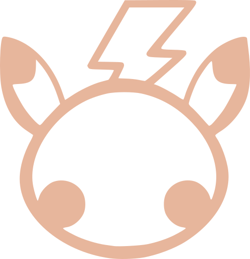

   
   <h1>Random Trinkkets</h1>

A small collection of random functions, files, and toys I make when I have nothing better to do.

### TL;DR
Originally one of my first repos while learning programming in general, specifically a python trinket repo. Now its just random files of different programming language, or something like that.

Not sure if I'll add testers or something, depends on mood (and if i learn how to)
